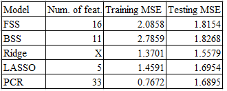
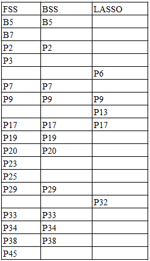

110065508, Cheng-En Lee

```{r setup, include=FALSE}
knitr::opts_chunk$set(echo = TRUE, warning=FALSE, message=FALSE)
```

### Data Source

```{r}
library(AppliedPredictiveModeling) #install package first!!
library(corrplot)  #correlation 
library(leaps)
library(glmnet)
library(pls)
library(boot)
```

## Problem 1: Chemical Manufacturing Process Data

### 1. Data Preprocessing

#### (1) Data discription

This data set consists of 177 samples of biological material for which 58 characteristics were measured. Of the 58 characteristics, there were 12 measurements of the biological starting material; 45 measurements of the manufacturing process, and one variable of the resulting final product yield (target variable).

The objective of this problem is to predict the yield given the other variable information. 

More data descriptions can be found by typing `help(ChemicalManufacturingProcess)` in r command.

```{r}
data(ChemicalManufacturingProcess)
#View(ChemicalManufacturingProcess)  #you may view data in table
#help(ChemicalManufacturingProcess)
#view(dfSummary(ChemicalManufacturingProcess))  #view data summary in html
```

#### (2) Remove NA`s

* There are several NA's in the data. We will only use the data with the complete variable information in this homework analysis.

* Rename the dataframe consisting of the complete variable information as **CMP**.

* Rename the variable for a shorten expression

```{r, fig.height = 9, fig.width = 9}
dim(ChemicalManufacturingProcess)
sum(is.na(ChemicalManufacturingProcess))
which(apply(is.na(ChemicalManufacturingProcess),1,sum)>0) #check which data sample has missing

CMP <- na.omit(ChemicalManufacturingProcess) #remove missing data
dim(CMP)
sum(is.na(CMP))

#rename variable
B_name = c()
for (i in 1:12){
  B_name[i] = paste("B",i,sep="")
}
P_name = c()
for (i in 1:45){
  P_name[i] = paste("P",i,sep="")
}
names(CMP) <- c("Yield",B_name, P_name)
```

#### (3) Correlation plot

Note: \texttt{pls} package also has a function named \texttt{corrplot}, which is not we want.

```{r}
corrplot::corrplot(cor(CMP))
```

#### (4) Note

* Fit regression models with various variable selection procedures.
* Go through all variable selection procedures taught in the class, to determine your best model (possibly more than one).
* Identify the important input variables (or any new features you defined) and carefully describe their impacts on the response yield.
* Evaluate your prediction performance via 5-fold cross validation.
* Give a brief analysis summary.

In this homework, I use MSE as the performance matric.

#### (5) Bad news: Best Subset does not work

Best subset selection is not feasible for R in this case due to the size of this dataset with the following error:

\texttt{Error in leaps.exhaustive(a, really.big) : 
Exhaustive search will be S L O W, must specify really.big=T}

Let`s turn to the other algorithms.

#### (6) Train test split

The splitting proportion is set to 0.7.

```{r}
set.seed(48763)
train <- sample(c(TRUE, FALSE), nrow(CMP), replace=TRUE, prob=c(0.7,0.3))
test <- !train
```

### 2. Forward Stepwise Selection

#### (1) The predict function

In order to conduct CV, we need a predict function since the class \texttt{regsubsets} does not have an in-build one.

```{r}
predict.regsubsets <- function(object, newdata, id, ...) {
  form <- as.formula(object$call[[2]])
  mat <- model.matrix(form, newdata)
  coefi <- coef(object, id = id)
  xvars <- names(coefi)
  mat[, xvars] %*% coefi
 }
```

#### (2) 5-fold CV

```{r}
# create a matrix in which we will store the results
k <- 5 # 5-fold CVs
n <- nrow(CMP[train, ])
set.seed(1)
folds <- sample(rep(1:k, length = n))
cv.errors <- matrix(NA, k, 56, dimnames = list(NULL, paste(1:56)))

# write a for loop that performs cross-validation
for (j in 1:k) {
  best.fit.fwd <- regsubsets(Yield ~ ., 
                             data = CMP[train, ][folds != j, ], 
                             nvmax = 56, 
                             method = "forward")
  for (i in 1:55) {
    pred <- predict(best.fit.fwd, CMP[train, ][folds == j, ], id = i)
    cv.errors[j, i] <- mean((CMP[train, ]$Yield[folds == j] - pred)^2)
   }
}

# Plot the MSE vs number of features
mean.cv.errors <- apply(cv.errors, 2, mean)
par(mfrow = c(1, 1))
plot(mean.cv.errors, type = "b")
```

Let`s find out the best model contains how many features

```{r}
which.min(mean.cv.errors) # How many features does the best model have
```

Since 16 is large enough so that the formula of the model is not suitable to type in the report, I present the coefficients of the model by the following code.

```{r}
reg.best.fwd <- regsubsets(Yield ~ ., 
                           data = CMP[train, ], 
                           nvmax = 56, 
                           method = "forward")
coef(reg.best.fwd, 16) # The coefficient
```

#### (3) Model Performance

The training performance

```{r}
mean.cv.errors[16] # training performance
```

Evaluate the model performance on the testing set

```{r}
test_pred <- predict(reg.best.fwd, CMP[test, ], id = 16)
MSE <- mean((CMP[test, ]$Yield - test_pred)^2)
MSE
```

### 3. Backward Stepwise Selection

All the process in this section is parallel to 3.

```{r}
# create a matrix in which we will store the results
k <- 5 # 5-fold CVs
n <- nrow(CMP[train, ])
set.seed(1)
folds <- sample(rep(1:k, length = n))
cv.errors <- matrix(NA, k, 56, dimnames = list(NULL, paste(1:56)))

# write a for loop that performs cross-validation
for (j in 1:k) {
  best.fit.bwd <- regsubsets(Yield ~ ., 
                             data = CMP[train, ][folds != j, ], 
                             nvmax = 56, 
                             method = "backward")
  for (i in 1:55) {
    pred <- predict(best.fit.bwd, CMP[train, ][folds == j, ], id = i)
    cv.errors[j, i] <- mean((CMP[train, ]$Yield[folds == j] - pred)^2)
   }
}

# Plot the MSE vs number of features
mean.cv.errors <- apply(cv.errors, 2, mean)
par(mfrow = c(1, 1))
plot(mean.cv.errors, type = "b")
```

```{r}
which.min(mean.cv.errors) # How many features does the best model have
```

```{r}
reg.best.bwd <- regsubsets(Yield ~ ., 
                           data = CMP[train, ], 
                           nvmax = 56, 
                           method = "forward")
coef(reg.best.bwd, 11) # The coefficient
```

#### (3) Model Performance

The training performance

```{r}
mean.cv.errors[11] # training performance
```

Evaluate the model performance on the testing set

```{r}
test_pred <- predict(reg.best.bwd, CMP[test, ], id = 11)
MSE <- mean((CMP[test, ]$Yield - test_pred)^2)
MSE
```

Note: It looks like there are some bugs in \texttt{regsubsets} since I cannot choose every features into the model. To be precisely, the argument \texttt{nvmax} can only set to 56. However, this does not affect the results since it is really unlikely that the best model contains ``every" features.

### 4. Ridge regression

#### (1) Divide the target variable and features

```{r}
x.train <- model.matrix(Yield ~ ., CMP[train, ])[, -1]
y.train <- CMP[train, ]$Yield
x.test <- model.matrix(Yield ~ ., CMP[test, ])[, -1]
y.test <- CMP[test, ]$Yield
```

#### (2) In-built CV

In the \texttt{glmnet} function, if the argument \texttt{alpha=0} then a ridge regression model is fit, and if \texttt{alpha=1} then a lasso model is fit.

```{r}
grid <- 10^seq(10, -2, length = 100) # use grid search to find lambda
set.seed(48763)
cv.out <- cv.glmnet(x.train, y.train, alpha = 0) # Ridge regression
plot(cv.out)
```

By the following code, we know that the best $\lambda\approx4.635$.

```{r}
bestlam_ridge <- cv.out$lambda.min # best lambda
bestlam_ridge
```

#### (3) Model Performance

Evaluate the performance of Ridge regression.

```{r}
# retrain the model with the best lambda
ridge.mod <- glmnet(x.train, y.train, alpha = 0, lambda = grid)

# training performance
ridge.pred <- predict(ridge.mod, s = bestlam_ridge, newx = x.train)
MSE_train <- mean((ridge.pred - y.train)^2) 

# testing performance
ridge.pred <- predict(ridge.mod, s = bestlam_ridge, newx = x.test)
MSE_test <- mean((ridge.pred - y.test)^2)

# results
MSE_train
MSE_test
```

#### (4) Important Features

Since Ridge regression does not really select variables, I show the coefficient of the first 20 features.

```{r}
ridge_coeff <- predict(ridge.mod, 
                       s = bestlam_ridge, 
                       exact = T, 
                       type = "coefficients", 
                       x = x.train, 
                       y = y.train)
ridge_coeff[1:20, ]
```

### 5. Lasso
The process in this section is parallel to 5.

```{r}
set.seed(1)
cv.out <- cv.glmnet(x.train, y.train, alpha = 1) # LASSO
plot(cv.out)
```

By the following code, we know that the best $\lambda\approx0.3673$.

```{r}
bestlam_lasso <- cv.out$lambda.min # best lambda
bestlam_lasso
```

```{r}
# retrain the model with the best lambda
lasso.mod <- glmnet(x.train, y.train, alpha = 1, lambda = grid)

# training performance
lasso.pred <- predict(lasso.mod, s = bestlam_lasso, newx = x.train)
MSE_train <- mean((lasso.pred - y.train)^2) 

# testing performance
lasso.pred <- predict(lasso.mod, s = bestlam_lasso, newx = x.test)
MSE_test <- mean((lasso.pred - y.test)^2)

# results
MSE_train
MSE_test
```

#### (4) Important Features

It turns out that LASSO selects 5 features only.

```{r}
lasso_coeff <- predict(lasso.mod, 
                       s = bestlam_lasso, 
                       exact = T, 
                       type = "coefficients", 
                       x = x.train, 
                       y = y.train)
lasso_coeff[1:57,][which(lasso_coeff!=0)]
```

```{r}
plot(lasso.mod)
```

### 6. PCA

Perform PCR on the training data.

```{r}
set.seed(48763)
pcr.fit <- pcr(Yield ~ ., 
               data = CMP, 
               subset = train,
               scale = TRUE, 
               validation = "CV")
validationplot(pcr.fit, val.type = "MSEP")
```

```{r}
MSEP_object <- MSEP(pcr.fit)
which.min(MSEP_object$val[1,1, ])
```

Hence PCR selects 33 features. Also, model performance can be evaluated

```{r}
# training performance
pcr.pred.train <- predict(pcr.fit, x.train, ncomp = 33)
MSE_pcr_train <- mean((pcr.pred.train - y.train)^2)

# testing performance
pcr.pred.test <- predict(pcr.fit, x.test, ncomp = 33)
MSE_pcr_test <- mean((pcr.pred.test - y.test)^2)

# results
MSE_pcr_train
MSE_pcr_test
```

### 7. Summary.

#### (1) Model performance

By the above discussion, the best model is Ridge regression, considering the testing MSE only. Both FSS and BSS are not performs as well as Ridge. However, considering the simplicity of the model, perhaps LASSO is more feasible since it only takes 5 features into consideration.

```{r}

```

Though PCR performs slightly better than LASSO, the gap between training MSE and testing MSE suggests that there is an overfitting. The same problems occurs when it comes to BSS.

#### (2) Important variables

The below table shows the important variables select by FSS, BSS, and LASSO. Only \texttt{P9} and \texttt{P17} is regarded important by all of the 3 algorithms. The coefficient in LASSO suggests that \texttt{P9} has a positive effect on \texttt{Yield}, while \texttt{P17} has a negative effect.

```{r}

```

------------------------------------------------------------- 
## Problem 2: Data with Outliers

For iid data $X_i, i=1,2,...,n$ from some distribution, the sample standard deviation $\hat{\sigma}$ is often used to estimate the population deviation $\sigma$: 
$$
\hat{\sigma} = \sqrt{\frac{1}{n-1}\sum_{i=1}^n (X_i-\bar{X})^2}.
$$
But sometimes, the observed data are contaminated with extreme values or outliers, due to recording errors or other reasons. In order to obtain a robust estimate for $\sigma$, $\tilde{\sigma}$ is considered:  
$$
\tilde{\sigma} = 1.4826 \cdot med_{1\le i\le n}\{|X_i-X_{med}|\}, 
$$
where $X_{med}$ denotes the sample median of $\{X_i:1\le i\le n\}$. 

Apply the nonparametric bootstrap method to evaluate the sampling distributions of $\tilde{\sigma}$ and $\hat{\sigma}$, and their estimation precision $var(\tilde{\sigma})$ and $var(\hat{\sigma})$.  

The data for problem 2: **hw3_problem2.csv**

```{r}
data <- read.table("hw3_problem2.csv", sep = ",", header=TRUE)[,2]
```

### 1. The function to evaluate the deviations

```{r}
sigma_hat <- function(dat, index) {
  X <- dat[index]
  sqrt((1/(length(dat)-1)) * (sum( (X-mean(X))^2 )))
}

sigma_tilde <- function(dat, index) {
  X <- dat[index]
  1.4826*median(abs(X-median(X)))
}
```

### 2. Bootstarp

```{r}
boot(data, sigma_hat, R = 1000)
```

```{r}
boot(data, sigma_tilde, R = 1000)
```

Hence we have 
$$\hat{\sigma}\approx3.7454,\text{ Var}(\hat{\sigma})\approx0.3698$$
and 
$$\tilde{\sigma}\approx2.5852,\text{ Var}(\tilde{\sigma})\approx0.2987$$
