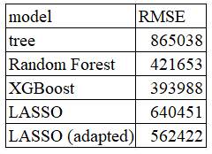
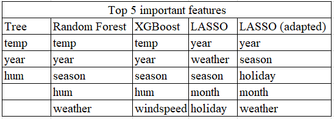
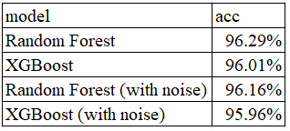
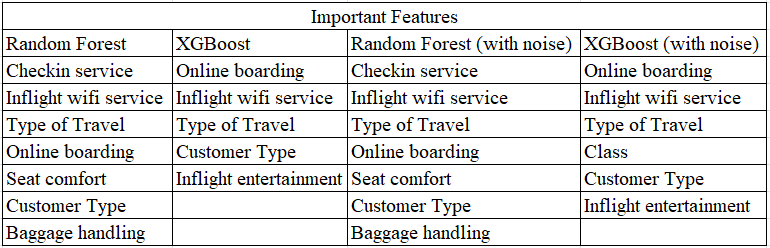

```{r setup, include=FALSE}
knitr::opts_chunk$set(echo = TRUE, warning=FALSE, message=FALSE)
library(tidyverse) # %>%
library(tree)
library(gbm)
library(randomForest)
library(glmnet)
library(ggplot2) 
library(class)
library(xgboost)
library(ggcorrplot)
```

## Problem 1: Bike Sharing Dataset

This data set collects the bike sharing counts aggregated on daily basis (2011-2012) together with the calender information (year/season/weekday/holiday) and daily weather conditions. 
There are 4 weather realted variables:  

* weathersit: (GOOD, MISTY, RAIN/SNOW/STORM) 

* temperature (in Celsius)  

* humidity (relative to 100%)

* windspeed 

The objective is to predict the bike sharing counts given a date, and figure out the impacts on the counts due to weather conditions.

More data descriptions can be found at http://archive.ics.uci.edu/ml/datasets/Bike+Sharing+Dataset

### Your analysis should include the following:

* EDA and preliminary findings.

* Fit tree-based models and summarize their prediction performance. The tuning parameters for tree-based models should be determined via cross validation.

* Fit a linear regression and a nonlinear regression model for the target variable **count**. Again, your models should go through a proper model selection procedure. Summarize the selected models with their prediction performance.

* Identify the important input variables for predicting bike sharing counts. In particular, characterize the effects of weather conditions on the bike counts **quantitatively**.

* Give a brief analysis summary.


```{r}
bike <- read.csv(file="bike.csv") #read data
head(bike) 
```

### 1. EDA

Guess: The count may be related to the season, weekday, and the weather condition. For example: In winter, people may not like to ride a bile. Besides, On weekdays, people need to take more rides to go to work. Also, when the weather is bad, it is unlikely people would like to ride a bike.

```{r}
fun_mean <- function(x){
  return(data.frame(y=mean(x), label= round(mean(x,na.rm=T), 1)))}

plot_box <- function(var, str){
  ggplot(bike,aes(x=var, y=count,fill=var))+
    geom_boxplot()+ # box plot
    stat_summary(fun.y=mean, geom="point", size=3,show.legend=F)+   # mean
    stat_summary(fun.data =fun_mean, geom="text", vjust=-0.7,show.legend=F)+  # mean
    xlab(str)+
    ylab('count')+
    ggtitle(paste("Boxplot of ", str, " and count"))+
    theme_minimal() +
    theme(plot.title=element_text(hjust=0.5,size=15),
          axis.title=element_text(size=15),
          axis.text = element_text(size=12),
          legend.text=element_text(size=12),
          legend.title=element_text(size=12),
          legend.position = 'top')}
```

#### (1) The Inpact of Season

```{r}
plot_box(bike$season, "season")
```

```{r}
plot_box(bike$month, "month")
```

So the guess is corrct -- It seems like the colder it is, the more unlikely people tend to ride a bike.

#### (2) The Inpact of Time

```{r, fig.height = 9, fig.width = 9}
bike$year <- as.character(bike$year)
plot_box(bike$year, "year")
```

In year 2012, people are more likely to ride a bike than 2011.

```{r}
plot_box(bike$holiday, "holiday")
```

```{r}
plot_box(bike$weekday, "weekday")
```

```{r}
plot_box(bike$workingday, "workingday")
```

From the box plots, no significance difference on counts are shown for working days or not. This is out of my initial guess.

#### (3) The Inpact of Weather Condition.

```{r}
plot_box(bike$weather, "weather")
```

My guess is correct again. When the weather is bad, people tend not to ride a bike.

```{r, fig.height = 9, fig.width = 9}
pairs(bike[,9:12], col=12, pch="+")
```

However, given the weather data such as \texttt{temp}, \texttt{hum} and \texttt{windspeed}, only \texttt{temp} shows a strong pattern. This is correspond with my initial inference that the colder it is, the fewer people ride bike.

#### (4) Correlation plot

```{r}
select_if(bike, is.numeric) %>%
  cor %>%
  round(.,1) %>%
  ggcorrplot(type='lower',
             lab = TRUE, 
             lab_size = 2, 
             tl.cex = 8,
             method="square", 
             colors = c("tomato2", "white", "#01A9DB"), 
             title="Correlogram Employmie Attritions", 
             ggtheme=theme_minimal())
```

Notice that no numeric features have a strong correlation, which is a good news.

#### (5) Data preprosessing

```{r}
# train-test split (70%-30%)
set.seed(1)
train_index <- sample(1:nrow(bike),(0.7*nrow(bike)))
train <- bike[train_index,2:12]
test <- bike[-train_index,2:12]
x_train <- train[,1:10]
y_train <- train[,11]
x_test <- test[,1:10]
y_test <- test[,11]
```

### 2. Tree-Based Models and Fine-Tuning

#### (1) Decision tree

I plant a big tree, then pruning it.

```{r}
set.seed(1)
tree.bike <- tree::tree(count ~ ., train)
summary(tree.bike)
plot(tree.bike)
text(tree.bike, pretty = 0)
```

The unpruned tree shows that the only important features are \texttt{temp}, \texttt{hum} and year. In winter (perhaps start with October), the weather becomes cold. Also, when it is raining (\texttt{hum} is high), people do not want to ride a bike. Using cross validation, I found that pruning a tree to size 7 improves the performance.

```{r}
cv.bike <- cv.tree(tree.bike)
plot(cv.bike$size, cv.bike$dev, type = "b")
```

```{r}
prune.bike <- prune.tree(tree.bike, best = 7)
plot(prune.bike)
text(prune.bike, pretty = 0)
```

This plot shows that two leaves are pruned. Under some conditions ($\texttt{temp}>12.3215$ and in year 2012), we need not to consider humidity (\texttt{hum}). 

Now we predict on the test set.

```{r}
yhat <- predict(tree.bike, newdata = test[,1:10])
y_test <- test[,"count"]
plot(yhat, y_test)
abline(0, 1)
mean((yhat - y_test)^2)
```

The RMSE of the tree is 865038.3.

#### (2) Random Forest

Since there are 10 features, I take $\texttt{mtry}=\lceil\sqrt{10}\rceil=4$.

```{r}
set.seed(1)
bag.bike <- randomForest(count ~ ., 
                         data = train,
                         mtry = 4,
                         ntree = 500,
                         importance = TRUE)
bag.bike
```

```{r}
yhat.bag <- predict(bag.bike, newdata = test[,1:10])
plot(yhat.bag, y_test)
abline(0, 1)
mean((yhat.bag - y_test)^2)
```

The random forest gives the RMSE 421652.6 on the test set, which is better than a pruned tree. Next, I show the important features

```{r}
varImpPlot(bag.bike)
```

If we use the elbow rule to select the important feature by MSE, it would be \texttt{year}, \texttt{temp}, \texttt{season}, \texttt{hum} and \texttt{weather}. This meets the analysis in EDA and tree algorithm.

#### (3) XGBoost

```{r}
#dummy 
train_dummy_X <- model.matrix(~.,train)[,-1]
train_dummy_X <- train_dummy_X[, colnames(train_dummy_X) != "count"]
test_dummy_X <- model.matrix(~.,test)[,-1]
test_dummy_X <- test_dummy_X[, colnames(test_dummy_X) != "count"]
train_dummy_y <- as.numeric(y_train)
test_dummy_y <- as.numeric(y_test)
```

Using gridsearch to find the best parameter of XGBoost. The code is commented or else it would take too long to knitting to PDF files.

```{r}
# create hyperparameter grid
hyper_grid <- expand.grid(
  eta = seq(0, 1, by=0.2),
  max_depth = c(2:5),
  min_child_weight = 2*c(1:5),
  subsample = c(0.6,0.7,0.8,0.9),
  colsample_bytree = c(0.6,0.7,0.8,0.9),
  optimal_trees = 0,               # a place to dump results
  min_error = 0)                   # a place to dump results
```

```{r}
# # grid search
# for(i in 1:nrow(hyper_grid)){
# 
#   # create parameter list
#   params <- list(
#     eta = hyper_grid$eta[i],
#     max_depth = hyper_grid$max_depth[i],
#     min_child_weight = hyper_grid$min_child_weight[i],
#     subsample = hyper_grid$subsample[i],
#     colsample_bytree = hyper_grid$colsample_bytree[i])
# 
#   # reproducibility
#   set.seed(123)
# 
#   # train model
#   xgb.tune <- xgb.cv(
#     params = params,
#     data = train_dummy_X,
#     label = train_dummy_y,
#     nrounds = 500,
#     nfold = 5,
#     objective='reg:squarederror',
#     eval_metric = "rmse",
#     verbose = 0,               # silent,
#     early_stopping_rounds = 10) # stop if no improvement for 10 consecutive trees
# 
# 
#   # add min training error and trees to grid
#   hyper_grid$optimal_trees[i] <- which.min(xgb.tune$evaluation_log$test_rmse_mean)
#   hyper_grid$min_error[i] <- min(xgb.tune$evaluation_log$test_rmse_mean)
# }
# 
# best_para <- hyper_grid %>%
#   dplyr::arrange(min_error) %>%
#   head(1)
```

Obtaining the best parameter as follow. 

```{r}
# #(best)
# eta=best_para$eta=0.2
# max_depth=best_para$max_depth=4
# min_child_weight=best_para$min_child_weight=2
# subsample=best_para$subsample=0.8
# colsample_bytree=best_para$colsample_bytree=0.8
# optimal_trees=best_para$optimal_trees=73
```

Now feed it into the XGBoost model.

```{r}
# parameter list
params <- list(
  eta = 0.2,
  max_depth = 4,
  min_child_weight = 2,
  subsample = 0.8,
  colsample_bytree = 0.8)

set.seed(1)
# train final model
modfinal_xgb <- xgboost(
  params = params,
  data = train_dummy_X, 
  label = train_dummy_y,
  nrounds = 100,
  objective='reg:squarederror',
  eval_metric = "rmse",
  verbose = 0)
```

```{r}
pred_y = predict(modfinal_xgb, test_dummy_X)
mean((y_test - pred_y)^2) #mse
```

This gives a very good 393987.6, outperforms than tree and Random forest! Perhaps this is why some people say XGBoost is ``secret weapon of Kaggle"

```{r}
xgb.importance(model = modfinal_xgb) %>% 
  as.data.frame() %>% 
  `colnames<-`(c("Feature",'Gain','Cover',"Frequency")) %>%
  arrange(desc(Gain)) %>% 
  top_n(15,wt = Gain) %>% 
  ggplot(aes(x = reorder(Feature, Gain),y = Gain)) +
  geom_col(fill = 'steelblue', color = 'black') +
  coord_flip() +
  ggtitle(label = "XGBoost") +
  xlab('Variable')+
  ylab('Gain')+
  theme(plot.title=element_text(hjust=0.5,size=15),
        axis.title=element_text(size=15))
```

XGBoost selects \texttt{temp}, \texttt{year}, \texttt{season} (whether it is winter or not), \texttt{hum}, \texttt{windspeed} as the most important features. The difference of XGBoost and the other algorithms is that XGBoost takes wind speed into consideration. 

### 3. Linear Regression and a Nonlinear Regression Model

#### (1) Linear Regression

First, First, I find the best $\lambda$ value of LASSO. Then, I use Lasso to select features.

```{r}
set.seed(1)
grid <- 10^seq(10, -2, length = 100) # use grid search to find lambda
cv.out <- cv.glmnet(train_dummy_X, train_dummy_y, alpha = 1, nfolds=5, lambda=grid) # LASSO
plot(cv.out)
```

```{r}
bestlam_lasso <- cv.out$lambda.min # best lambda
bestlam_lasso
```

```{r}
# retrain the model with the best lambda
lasso.bike <- glmnet(train_dummy_X, train_dummy_y, alpha = 1, lambda = grid)

# training performance
lasso.pred <- predict(lasso.bike, s = bestlam_lasso, newx = train_dummy_X)
MSE_train <- mean((lasso.pred - train_dummy_y)^2) 

# testing performance
lasso.pred <- predict(lasso.bike, s = bestlam_lasso, newx = test_dummy_X)
MSE_test <- mean((lasso.pred - test_dummy_y)^2)

# results
MSE_train
MSE_test
```

```{r}
lasso_coeff <- predict(lasso.bike, 
                       s = bestlam_lasso, 
                       exact = T, 
                       type = "coefficients", 
                       x = train_dummy_X, 
                       y = train_dummy_y)
lasso_coeff[1:29,][which(lasso_coeff!=0)]
```

This shows that LASSO takes \texttt{season}, \texttt{weekday}, \texttt{month}, \texttt{year}, and the weather condition into consideration. On top of that, by the following graph, the most important five features are \texttt{year}, \texttt{weather}, \texttt{season}, \texttt{month}, and \texttt{holiday}.

```{r}
plot(lasso.bike)
```

#### (2) Nonlinear Regression

From EDA, we found that count and temp has a pattern. Hence, I add the square of \texttt{temp} into the dataset to see if the performence improves.

```{r}
train_dummy_X2 <- cbind(train_dummy_X, train_dummy_X[,"temp"]^2)
test_dummy_X2 <- cbind(test_dummy_X, test_dummy_X[,"temp"]^2)
```

First, I find the best $\lambda$ value of LASSO.

```{r}
set.seed(1)
grid <- 10^seq(10, -2, length = 100) # use grid search to find lambda
cv.out <- cv.glmnet(train_dummy_X2, train_dummy_y, alpha = 1, nfolds=5, lambda=grid) # LASSO
plot(cv.out)
```

```{r}
bestlam_lasso <- cv.out$lambda.min # best lambda
bestlam_lasso
```

```{r}
# retrain the model with the best lambda
lasso.bike2 <- glmnet(train_dummy_X2, train_dummy_y, alpha = 1, lambda = grid)

# training performance
lasso.pred2 <- predict(lasso.bike2, s = bestlam_lasso, newx = train_dummy_X2)
MSE_train <- mean((lasso.pred2 - train_dummy_y)^2) 

# testing performance
lasso.pred2 <- predict(lasso.bike2, s = bestlam_lasso, newx = test_dummy_X2)
MSE_test <- mean((lasso.pred2 - test_dummy_y)^2)

# results
MSE_train
MSE_test
```

The testing RMSE is 562421.6, which is improved comparing without the quadratic terms of \texttt{temp}.

```{r}
lasso_coeff <- predict(lasso.bike2, 
                       s = bestlam_lasso, 
                       exact = T, 
                       type = "coefficients", 
                       x = train_dummy_X, 
                       y = train_dummy_y)
lasso_coeff[1:29,][which(lasso_coeff!=0)]
```

```{r}
plot(lasso.bike2)
```

### 4. Summary

The RMSE on testing set and selected features are presented in the following tables.

```{r}

```

```{r}

```

Among all the models, XGBoost gives the best regression performance. To sum up, from the features selected by each model, we may conduct the following inference:

(1) In year 2012, either more people knows the sharing bikes, or more bikes are available. Hence the number of people renting a bike increases.

(2) When the weather condition is bad, such as raining (high humidity), or it is too cold (in winter months), people are not willing to rent a bike.

(3) During the break, such as weekend or holiday, people are more likely to rent a bike. Perhaps people drive or take an MRT to work since it is too far for a bike.

------------------------------------------------------------- 
## Problem 2: Airline Customer Satisfaction


This dataset contains an airline passenger satisfaction survey. 
The data collect the demographic information about the customers, their feedback regarding the flight experiences and some flight information.

The goal of the analysis has two folds: 
  
* Find a good model for the classification of customer satisfaction, and summarize the performance. 

* Identify the important aspects of the flight experience related to customer satisfaction (or dis-satisfaction).
Based on your findings, give some specific suggestions (provided with the data evidence) to the airline company for achieving a higher customer satisfaction. 

* Add some noise factors (both continuous variable and categorical variable) in your data set (call these added variables z1-z?), and check the ranking of variable importance of these z-variables relative to the original meaningful input variables. Make your comments regarding this experiment. 


More data descriptions can be found at 
https://www.kaggle.com/teejmahal20/airline-passenger-satisfaction

```{r}
survey <- read.csv(file="airline.csv") #read data
head(survey)
survey1 <- na.omit(survey) #remove missing data
```

### 1. Classification Model

```{r}
# train-test split (70%-30%)
set.seed(48763)
train_index <- sample(1:nrow(survey1),(0.7*nrow(survey1)))
train_survey <- survey1[train_index,2:24]
test_survey <- survey1[-train_index,2:24]
x_train_survey <- train_survey[,1:22]
y_train_survey <- train_survey[,23]
x_test_survey <- test_survey[,1:22]
y_test_survey <- test_survey[,23]
train_dummy_X_survey <- model.matrix(~.,train_survey)[,2:23]
train_dummy_X_survey <- train_dummy_X_survey[, colnames(train_dummy_X_survey) != "satisfaction"]
test_dummy_X_survey <- model.matrix(~.,test_survey)[,2:23]
test_dummy_X_survey <- test_dummy_X_survey[, colnames(test_dummy_X_survey) != "satisfaction"]
train_dummy_y_survey <- as.numeric(as.factor(y_train_survey))-1 # change label to 0 and 1
test_dummy_y_survey <- as.numeric(as.factor(y_test_survey))-1
```

#### (1) RandomForest

Since random forest always performs better than a tree, I do not take tree into consideration in this problem.

```{r}
set.seed(1)
bag.surv <- randomForest(x = x_train_survey,
                         y = as.factor(y_train_survey),
                         mtry = 5,
                         ntree = 500,
                         importance = TRUE)
bag.surv
```

```{r}
y_pred <- predict(bag.surv, newdata = x_test_survey)
# Confusion Matrix
confusion_mtx = table(as.factor(y_test_survey), y_pred)
confusion_mtx
```

```{r}
(17199+12726)/(17199+12726+771+383)
```

The accuracy is $96.29\%$.

```{r}
varImpPlot(bag.surv)
```

In the left panel (i.e., considering the accuracy), it seems like some of the features ranked after 7 share same importance. The top 7 importance feature (choose 7 since there is a significant gap) are \texttt{Checkin service}, \texttt{Inflight wifi service}, \texttt{Type of Travel}, \texttt{Online boarding}, \texttt{Seat comfort}, \texttt{Customer Type}, and \texttt{Baggage handling}. 

#### (2) XGBoost

Using gridsearch to find the best parameter of XGBoost. The code is commented or else it would take too long to knitting to PDF files.

```{r}
# # grid search
# for(i in 1:nrow(hyper_grid)){
# 
#   # create parameter list
#   params <- list(
#     eta = hyper_grid$eta[i],
#     max_depth = hyper_grid$max_depth[i],
#     min_child_weight = hyper_grid$min_child_weight[i],
#     subsample = hyper_grid$subsample[i],
#     colsample_bytree = hyper_grid$colsample_bytree[i])
# 
#   # reproducibility
#   set.seed(123)
# 
#   # train model
#   xgb.tune <- xgb.cv(
#     params = params,
#     data = train_dummy_X_survey,
#     label = train_dummy_y_survey,
#     nrounds = 500,
#     nfold = 5,
#     objective='binary:logistic',
#     eval_metric = "error",
#     verbose = 0,               # silent,
#     early_stopping_rounds = 10) # stop if no improvement for 10 consecutive trees
# 
# 
#   # add min training error and trees to grid
#   hyper_grid$optimal_trees[i] <- which.min(xgb.tune$evaluation_log$test_error_mean)
#   hyper_grid$min_error[i] <- min(xgb.tune$evaluation_log$test_error_mean)
# }
# 
# best_para <- hyper_grid %>%
#   dplyr::arrange(min_error) %>%
#   head(1)
```

Obtaining the best parameter as follow. This takes me about 16 hours!

```{r}
# #(best)
# eta=best_para$eta=0.2
# max_depth=best_para$max_depth=5
# min_child_weight=best_para$min_child_weight=2
# subsample=best_para$subsample=0.9
# colsample_bytree=best_para$colsample_bytree=0.9
# optimal_trees=best_para$optimal_trees=125
```

Now feed it into the XGBoost model.

```{r}
# parameter list
params <- list(eta = 0.2,
               max_depth = 5,
               min_child_weight = 2,
               subsample = 0.9,
               colsample_bytree = 0.9)

set.seed(1)
# train final model
modfinal_xgb_survey <- xgboost(params = params,
                               data = train_dummy_X_survey,
                               label = train_dummy_y_survey,
                               nrounds = 100,
                               objective='binary:logistic',
                               eval_metric = "error",
                               verbose = 0)
```

```{r}
y_pred <- predict(modfinal_xgb_survey, newdata = test_dummy_X_survey)
y_pred <- as.numeric(y_pred > 0.5)
# Confusion Matrix
confusion_mtx = table(test_dummy_y_survey, y_pred)
confusion_mtx
```

```{r}
(17180+12660)/(17180+12660+402+837)
```

The accuracy is $96.01\%$.

```{r}
xgb.importance(model = modfinal_xgb_survey) %>% 
  as.data.frame() %>% 
  `colnames<-`(c("Feature",'Gain','Cover',"Frequency")) %>%
  arrange(desc(Gain)) %>% 
  top_n(15,wt = Gain) %>% 
  ggplot(aes(x = reorder(Feature, Gain),y = Gain)) +
  geom_col(fill = 'steelblue', color = 'black') +
  coord_flip() +
  ggtitle(label = "XGBoost") +
  xlab('Variable')+
  ylab('Gain')+
  theme(plot.title=element_text(hjust=0.5,size=15),
        axis.title=element_text(size=15))
```

The top 5 importance feature are \texttt{Online boarding}, \texttt{Inflight wifi service}, \texttt{Type of Travel}, \texttt{Customer Type}, \texttt{Inflight entertainment}.

### 3. Noise factors Experiment

#### (1) Adding Noise

```{r}
X_train_noise <- cbind(train_dummy_X_survey, 
                       rnorm(nrow(train_dummy_X_survey)), 
                       rbinom(n=nrow(train_dummy_X_survey),size=1,prob=0.5))
X_test_noise <- cbind(test_dummy_X_survey, 
                      rnorm(nrow(test_dummy_X_survey)), 
                      rbinom(n=nrow(test_dummy_X_survey),size=1,prob=0.5))
# Must specify the column name of the new features,
# or else random forest cannot predict
colnames(X_train_noise)[23:24] <- c("gaussian_noise", "catgorical_noise") 
colnames(X_test_noise)[23:24] <- c("gaussian_noise", "catgorical_noise")
```

#### (2) Repeat Random forest

```{r}
set.seed(1)
bag.noise <- randomForest(x = X_train_noise, 
                          y = as.factor(y_train_survey),
                          mtry = 5,
                          ntree = 500,
                          importance = TRUE)
```

```{r}
y_pred_noise <- predict(bag.noise, newdata = X_test_noise)
confusion_mtx = table(as.factor(y_test_survey), y_pred_noise)
confusion_mtx
```

```{r}
(17182+12705)/(17182+12705+792+400)
```

The accuracy is $96.16\%$.

```{r}
varImpPlot(bag.noise)
```

The top 7 importance feature remains the same, and the noise terms are the least importance, which does not affect the performance of the random forest algorithm.

#### (3) Repeat XGBoost

The code is commented or else it would take too long to knitting to PDF files.

```{r}
# # grid search
# for(i in 1:nrow(hyper_grid)){
# 
#   # create parameter list
#   params <- list(
#     eta = hyper_grid$eta[i],
#     max_depth = hyper_grid$max_depth[i],
#     min_child_weight = hyper_grid$min_child_weight[i],
#     subsample = hyper_grid$subsample[i],
#     colsample_bytree = hyper_grid$colsample_bytree[i])
# 
#   # reproducibility
#   set.seed(123)
# 
#   # train model
#   xgb.tune <- xgb.cv(
#     params = params,
#     data = X_train_noise,
#     label = train_dummy_y_survey,
#     nrounds = 500,
#     nfold = 5,
#     objective='binary:logistic',
#     eval_metric = "error",
#     verbose = 0,               # silent,
#     early_stopping_rounds = 10) # stop if no improvement for 10 consecutive trees
# 
# 
#   # add min training error and trees to grid
#   hyper_grid$optimal_trees[i] <- which.min(xgb.tune$evaluation_log$test_error_mean)
#   hyper_grid$min_error[i] <- min(xgb.tune$evaluation_log$test_error_mean)
# }
# 
# best_para_noise <- hyper_grid %>%
#   dplyr::arrange(min_error) %>%
#   head(1)
```


```{r}
# #(best)
# eta=best_para$eta=0.2
# max_depth=best_para$max_depth=5
# min_child_weight=best_para$min_child_weight=6
# subsample=best_para$subsample=0.8
# colsample_bytree=best_para$colsample_bytree=0.9
# optimal_trees=best_para$optimal_trees=148
```

Now feed it into the XGBoost model.

```{r}
# parameter list
params <- list(eta = 0.2,
               max_depth = 5,
               min_child_weight = 6,
               subsample = 0.8,
               colsample_bytree = 0.9)

set.seed(1)
# train final model
modfinal_xgb_noise <- xgboost(params = params,
                              data = X_train_noise,
                              label = train_dummy_y_survey,
                              nrounds = 100,
                              objective='binary:logistic',
                              eval_metric = "error",
                              verbose = 0)
```

```{r}
y_pred <- predict(modfinal_xgb_noise, newdata = X_test_noise)
y_pred <- as.numeric(y_pred > 0.5)
# Confusion Matrix
confusion_mtx = table(test_dummy_y_survey, y_pred)
confusion_mtx
```

```{r}
(17165+12657)/(17165+12657+840+417)
```

The accuracy is $95.96\%$.

```{r}
xgb.importance(model = modfinal_xgb_noise) %>% 
  as.data.frame() %>% 
  `colnames<-`(c("Feature",'Gain','Cover',"Frequency")) %>%
  arrange(desc(Gain)) %>% 
  top_n(15,wt = Gain) %>% 
  ggplot(aes(x = reorder(Feature, Gain),y = Gain)) +
  geom_col(fill = 'steelblue', color = 'black') +
  coord_flip() +
  ggtitle(label = "XGBoost") +
  xlab('Variable')+
  ylab('Gain')+
  theme(plot.title=element_text(hjust=0.5,size=15),
        axis.title=element_text(size=15))
```

The top 6 importance feature are \texttt{Online boarding}, \texttt{Inflight wifi service}, \texttt{Type of Travel}, \texttt{Class}, \texttt{Customer Type}, \texttt{Inflight entertainment}. This is slightly different with the original XGBoost, where \texttt{Class} is the 6th most important feature and now becomes 4.

### 4. Summary

The accuracy of testing set and selected features are presented in the following tables.

```{r}

```

```{r}

```

(1) Adding 1 column of Gaussian noise and 1 column of categorical noise does not affect the tree-based model performance much.

(2) To get higher passenger satisfication, the airline company had to improve online boarding, checkin service and wifi service since these three features are the most important. Also, be good to those passengers taking a personal travel. Other measurements such as improve the seat comfort and inflight entertainment would also helps.
